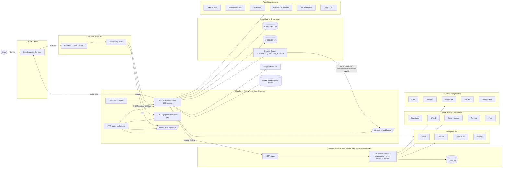

# Architecture

Canonical reference for how this repository is organised at runtime. Plans live under [docs/plans/](plans/) and [docs/superpowers/](superpowers/) — this file documents what is **already built**.

## 1. Repository layout

```
LinkedInPost/
├── frontend/                  # React 19 + Vite SPA (the "dashboard")
├── worker/                    # Main Cloudflare Worker (API + asset host)
├── generation-worker/         # Separate Cloudflare Worker for the content pipeline
├── packages/
│   ├── llm-core/              # Shared LLM provider types + static model lists
│   └── researcher/            # News aggregator (RSS, NewsAPI, NewsData, SerpAPI)
├── setup/                     # Python setup CLI + wizard (Node)
│   └── wizard/                # Browser setup wizard (port 3456)
├── scripts/                   # generate_features.py, setup-*.sh launchers
├── features.yaml              # Source of truth for feature flags
├── wrangler.jsonc             # Root config — main worker also serves frontend/dist
└── docs/                      # This folder (plans, specs, this architecture doc)
```

`package.json` declares `workspaces: ["packages/*", "generation-worker", "worker"]`. `frontend/` and `setup/wizard/` are independent npm projects.

## 2. System diagram



A few things the diagram intentionally simplifies:

- **Auth is on every request.** `Action` re-verifies the Google ID token on every `/action` call, not just at sign-in.
- **`Action` to `Channels` happens on publish/schedule.** The same action also writes status back to Google Sheets and uploads selected images to GCS.
- **Generation worker auth.** Main worker calls the generation worker over the service binding with `Authorization: Bearer ${GENERATION_WORKER_SECRET}`; that secret matches `WORKER_SHARED_SECRET` on the generation worker.

## 3. Frontend (`frontend/`)

**Stack**

| Layer | Choice |
|---|---|
| Framework | React 19.2 |
| Build | Vite 8.0 + TypeScript 5.9 |
| Routing | React Router 7 (`BrowserRouter` with optional `basename` from `import.meta.env.BASE_URL`) |
| Styling | Tailwind v4 (`@tailwindcss/vite`) + `tw-animate-css` + Framer Motion 12 |
| UI primitives | `@base-ui/react`, `lucide-react`, `class-variance-authority`, `tailwind-merge` |
| Auth | `@react-oauth/google` — Google ID token in `localStorage.google_id_token` |
| Audio | `@huggingface/transformers` + `nodejs-whisper` (local STT server in dev) |
| Media | `ffmpeg-static`, `fluent-ffmpeg`, `multer` (uploads in dev STT server) |
| Validation | `zod` |
| Testing | Playwright 1.59 e2e, Vitest 4.1 unit |

**Local dev** — `npm run dev` runs three concurrent servers via `concurrently`:

1. Vite (port **5174**, `strictPort`)
2. STT server — `frontend/server/sttServer.js`
3. Setup wizard — `frontend/server/setupWizard.js` (port 3456)

**Routing** — see [`frontend/src/features/topic-navigation/utils/workspaceRoutes.ts`](../frontend/src/features/topic-navigation/utils/workspaceRoutes.ts):

| Path | Purpose |
|---|---|
| `/` | SaaS landing (waitlist) or login screen — depends on `deploymentMode` |
| `/about`, `/pricing`, `/terms`, `/privacy-policy` | Static marketing pages |
| `/topics`, `/topics/new` | Topic queue + scratchpad form |
| `/topics/:topicId` | Variant carousel for a row |
| `/topics/:topicId/editor/:variantSlot` | 3-panel draft editor |
| `/settings` | Bot config, integrations, AI/LLM, Telegram, email |
| `/connections` | OAuth-style channel hookup screen |
| `/rules` | Generation rules (global + per-topic) |
| `/campaign` | Bulk import / Claude-JSON paste (gated by `FEATURE_CAMPAIGN`) |
| `/feed` | Article feed, clips, interest groups |
| `/trending` | YouTube / LinkedIn / Instagram trending panels |
| `/enrichment` | Multi-skill enrichment workspace (gated by `FEATURE_ENRICHMENT`) |
| `/automations` | Admin automation rules |
| `/usage` | Token usage + budget meter (SaaS mode) |
| `/setup` | Admin setup wizard (deep links into `/setup/...`) |
| `/admin` | Admin tenant settings, model config (SaaS mode) |

**State** — Local component state + React Context (`AlertProvider`, `AppSession`). No Redux/Zustand. Server data flows through a single `BackendApi` instance (`useMemo` in `App.tsx`).

**API client** — [`frontend/src/services/backendApi.ts`](../frontend/src/services/backendApi.ts) — every server call dispatches via `POST {VITE_WORKER_URL}/action` with `{ action, payload, idToken }`. The exception is generation, which streams from `POST /api/generate/stream` over SSE.

**Feature flags** — `frontend/src/generated/features.ts` is auto-generated from `features.yaml` by `scripts/generate_features.py`. Current flags:

- `deploymentMode` — `'saas' | 'selfHosted'`
- `FEATURE_CAMPAIGN`
- `FEATURE_CONTENT_FLOW`
- `FEATURE_CONTENT_REVIEW`
- `FEATURE_ENRICHMENT`
- `FEATURE_MULTI_PROVIDER_LLM`
- `FEATURE_NEWS_RESEARCH`

**E2E** — `frontend/playwright.config.ts`. Run with `npm run test:e2e` (or `:ui`, `:headed`). Setup-wizard tests: `npm run test:e2e:setup` from `frontend/`, or `npm run test:setup` from the repo root (covers Python wizard + React wizard).

## 4. Main worker (`worker/`)

`worker/src/index.ts` is a single ~5900-line entry point that handles everything. Routes resolve in two layers: HTTP-prefix routes first, then the catch-all `POST /action` action dispatcher.

**Wrangler config** ([`worker/wrangler.jsonc`](../worker/wrangler.jsonc))

| Binding | Type | Notes |
|---|---|---|
| `PIPELINE_DB` | D1 | `linkedin-pipeline-db`; migrations in `worker/migrations/` |
| `CONFIG_KV` | KV | shared dashboard config |
| `SCHEDULED_LINKEDIN_PUBLISH` | Durable Object | class `ScheduledPublishAlarm`; alarms re-enter via `/internal/schedule-linkedin-publish` |
| `GENERATION_WORKER` | Service binding | → `linkedin-generation-worker` |
| Cron | `0 3 * * *` | nightly maintenance |

**HTTP routes** (top-of-router, exact pathname matches in `src/index.ts`):

| Method | Path | Purpose |
|---|---|---|
| `GET` | `/` | Health JSON envelope (also where root `wrangler.jsonc` serves built `frontend/` assets) |
| `GET` | `/v1/image-gen-catalog` | Image-gen model catalog |
| `GET` | `/api/usage` | Per-user token usage + budget |
| `GET` | `/auth/linkedin/callback` | OAuth popup callback |
| `GET` | `/auth/instagram/callback` | OAuth popup callback |
| `GET` | `/auth/whatsapp/callback` | OAuth popup callback |
| `GET` | `/auth/gmail/callback` | OAuth popup callback |
| `GET` | `/auth/youtube/callback` | OAuth popup callback |
| `POST` | `/api/waitlist` | SaaS waitlist signup |
| `POST` | `/internal/schedule-linkedin-publish` | Durable Object alarm callback |
| `POST` | `/internal/merged-rows` | Internal merge of Sheets + D1 rows |
| `POST` | `/internal/pipeline-upsert` | Internal row upsert |
| `GET` | `/internal/github-automation-gemini-model` | GitHub Actions ↔ worker integration |
| `POST` | `/internal/github-automation-generate-variants` | GitHub Actions ↔ worker integration |
| `POST` | `/api/generate/stream` | Main generation flow — SSE or JSON, proxies the generation worker |
| `*` | `/webhooks/*` | Per-channel inbound webhooks |
| `*` | `/automations/*` | Automation rule CRUD + triggers |
| `*` | `/automations/internal/*` | Internal automation runners |
| `POST` | `/action` | All other actions (default dispatcher) |

**Action dispatcher** — `dispatchAction()` is a `case` switch on `payload.action`. There are roughly 100 cases. Major groupings:

- **Session / auth** — `bootstrap`, `completeOnboarding`, `getIntegrations`, `deleteIntegration`, `disconnectChannelAuth`, `connectSpreadsheet`, `disconnectSpreadsheet`, `getServiceAccountEmail`
- **LLM** — `listLlmModels`, `getLlmProviderCatalog`, `getLlmSettings`, `saveLlmSetting`, `getGoogleModels`, `getUsageSummary`, `getUsageSummaryByRange`
- **Topics + sheet rows** — `getRows`, `addTopic`, `updateTopicMeta`, `updateRowStatus`, `deleteRow`, `saveDraftVariants`, `saveEmailFields`, `createDraftFromPublished`, `updatePostSchedule`, `bulkImportCampaign`, `syncFromSheets`, `getSpreadsheetStatus`
- **Generation** — `generateQuickChange`, `generateVariantsPreview`, `callGenerationWorker`, `runContentReview`, `getNodeRuns`, `getNodeCatalog`, `getPatternAssignment`, `listPatternAssignments`, `assignPattern`, `savePatternMetadata`, `getTestGroup`, `listPatterns`
- **Rules + templates** — `getGenerationRulesHistory`, `saveTopicGenerationRules`, `listPostTemplates`, `createPostTemplate`, `updatePostTemplate`, `deletePostTemplate`, `saveGenerationTemplateId`, `saveTopicDeliveryPreferences`
- **Personas + workflows** — `listCustomPersonas`, `createCustomPersona`, `deleteCustomPersona`, `listCustomWorkflows`, `createCustomWorkflow`, `updateCustomWorkflow`, `deleteCustomWorkflow`
- **Feed / clips / research** — `getFeedArticles`, `refreshFeedArticles`, `setArticleFeedback`, `getArticleFeedback`, `analyzeFeedArticle`, `clusterDraftClips`, `listClips`, `createClip`, `updateClip`, `deleteClip`, `assignClipToPost`, `unassignClipFromPost`, `listInterestGroups`, `createInterestGroup`, `updateInterestGroup`, `deleteInterestGroup`, `searchNewsResearch`, `listNewsResearchHistory`, `getNewsResearchSnapshot`
- **Topic insights / debate / enrichment** — `analyzeTopicInsights`, `findDraftConnections`, `findDebateArticle`, `crossDomainInsight`, `opinionLeaderInsights`
- **Trending** — `trendingSearch`, `trendingYouTube`, `trendingLinkedIn`, `trendingInstagram`
- **Channel OAuth** — `startLinkedInAuth`, `startInstagramAuth`, `startWhatsAppAuth`, `startGmailAuth`, `startYouTubeAuth`, `completeWhatsAppConnection`, `verifyTelegramChat`
- **Media** — `fetchDraftImages`, `promoteDraftImageUrl`, `uploadDraftImage`, `uploadContextDocument`, `generateImageWithReference`
- **Publish + schedule** — `publishContent`, `cancelScheduledPublish`, `updatePostSchedule`
- **Config + admin** — `saveConfig`, `saveUserSettings`, `adminListTenantSettings`

**LLM providers** — pluggable under `worker/src/llm/providers/`:

- `gemini.ts` — Google Gemini (default)
- `grok.ts` — xAI Grok
- `openrouter.ts` — OpenRouter (multi-model gateway)
- `minimax.ts` — Minimax

The provider abstraction (`LlmRef`, `LlmModelOption`, `LlmProviderId`) is shared with the frontend via `@repo/llm-core`. Multi-provider is gated by `FEATURE_MULTI_PROVIDER_LLM`.

**D1 schema** — migrations under `worker/migrations/` (0001 through 0020 today). Major tables:

| Table | Purpose |
|---|---|
| `users` | email, onboarding flag, spreadsheet id, tenant settings, status, budget |
| `social_integrations` | connected channels per user (provider, internal id, display name, avatar, reauth flag) |
| `sheet_rows` | mirror of Google Sheets rows + variants + status + schedule |
| `llm_settings` | per-user provider/model preferences |
| `llm_usage` | per-call token + cost log |
| `post_templates` | saved generation rules |
| `template_assignments` | which template applies where |
| `pattern_assignments` | A/B pattern test groups |
| `interest_groups` | feed taxonomy |
| `clips` | reusable clip library |
| `node_runs` | generation pipeline trace per row |
| `image_gen_model_catalog` | image-gen models + provider configs |
| `custom_personas`, `custom_workflows` | user-defined personas + workflow nodes |
| `newsletters`, `newsletter_voice` | newsletter feature tables |
| `news_snapshots` | cached news research per topic |
| `scheduled_publish` (via DO) | schedule alarms |

**Cron** — `0 3 * * *` triggers `scheduled` handler (housekeeping such as 30-day data retention from migration `0013_data_retention_30day.sql`).

## 5. Generation worker (`generation-worker/`)

A separate Cloudflare Worker (`linkedin-generation-worker`) that runs the content pipeline. It is **not** the main API — only the main worker calls it, over a service binding.

**Wrangler config** ([`generation-worker/wrangler.jsonc`](../generation-worker/wrangler.jsonc))

- D1 binding `GEN_DB` → `linkedin-gen-worker-db`
- `usage_model: unbound`, `compatibility_flags: ["nodejs_compat"]`
- Bundles `**/*.md` knowledge files as text

**Auth** — bearer token in `Authorization` header against env `WORKER_SHARED_SECRET`. Empty secret disables the check (dev only).

**Routes** ([`generation-worker/src/index.ts`](../generation-worker/src/index.ts))

| Method | Path | Purpose |
|---|---|---|
| `GET` | `/v1/patterns` | Compact summaries from the bundled pattern repository |
| `GET` | `/v1/patterns/full` | Full pattern objects (outline, few-shot lines, image hints) |
| `GET` | `/v1/llm/catalog` | Provider + model discovery (mirrors main worker `listLlmModels`) |
| `POST` | `/v1/generate` | Generation pipeline. Accepts `Accept: text/event-stream` for SSE |
| `POST` | `/v1/feedback` | Save feedback on a previous run |
| `POST` | `/v1/suggest-pattern` | Build a `RequirementReport` and pick the best pattern |

**Pipeline** ([`generation-worker/src/pipeline.ts`](../generation-worker/src/pipeline.ts)) — `runPipeline()` emits `progress` SSE events at each stage:

1. `llm_ref` — resolve provider/model from request + worker env
2. `pattern` — load bundled patterns and pick one with `findPattern()`
3. `research` — optional news aggregation (only when `report.factual && req.newsResearchConfig`)
4. `enrichment` (when `FEATURE_ENRICHMENT` is on) — multi-skill orchestrator → enriched variants → `selector` picks top 4
   `creator` (legacy path) — `createVariants()` directly
5. `review` — content QA against the pattern's review checklist
6. `images` — keyword + candidate selection per variant
7. `saving` — persist run to `GEN_DB.generation_runs`

**Bundled domain knowledge** — `generation-worker/src/modules/*/knowledge/*.md` — channel rules, copywriting patterns, personas, viral patterns, psychology. These are bundled as text by the `rules.globs: ["**/*.md"]` Wrangler entry; do not edit unless you are tuning the model.

**Image generation** — `generation-worker/src/image-gen/` integrates Stability AI, DALL-E, Gemini Imagen, Runway, Fal.ai. Picker logic lives in `players/imageRelator.ts` + `players/imagePicker.ts`.

**GEN_DB schema** — single migration `0001_gen_init.sql`: `generation_runs` (run id, pattern, llm ref, variants, trace, images JSON) + `feedback`.

## 6. Shared packages

**`packages/llm-core` (`@repo/llm-core`)** — types and static fallback model lists shared between worker, generation worker, and frontend. Exports:

- `LlmProviderId` — `'gemini' | 'grok' | 'openrouter' | 'minimax'`
- `LlmRef` — `{ provider: LlmProviderId; model: string }`
- `LlmModelOption` — model metadata (name, context window, capabilities)
- Provider helpers + zod schemas in `providers.ts`, `schemas.ts`, `static-models.ts`

**`packages/researcher` (`@linkedinpost/researcher`)** — news aggregator. Exports:

- `runNewsResearch(env, config, topicSpec)` — fan-out across RSS, NewsAPI, NewsData, SerpAPI, Google News
- `trimForPrompt(articles)` — prep for LLM context
- `ResearchArticleRef` types

Used by the generation worker pipeline (research stage) and by the main worker `searchNewsResearch` action.

## 7. Auth & multi-tenancy

**Sign-in** — `@react-oauth/google` returns a Google ID token. Frontend stores it in `localStorage.google_id_token` and sends it in every `BackendApi` call. Worker re-verifies the token on every request against `GOOGLE_CLIENT_ID`.

**Authorization** — two `vars` in `wrangler.jsonc`:

- `ALLOWED_EMAILS` — space- or comma-separated allowlist. Non-listed users get `Access not granted` (or pending-review in SaaS mode).
- `ADMIN_EMAILS` — subset of allowlist with elevated UI (admin sidebar entry, setup screen, automation rule editor).

**Deployment modes** (`features.yaml: deploymentMode`):

| Mode | Behaviour |
|---|---|
| `saas` | Hosted multi-tenant. Landing page + waitlist on `/`. Per-user tenant rows in `users` table. Token usage meter visible. Admin tier visible in header. |
| `selfHosted` | Single-owner. Direct sign-in on `/`. No waitlist or usage meter. |

**Dev bypass** — when `import.meta.env.DEV` and a `DEV_AUTH_BYPASS_SECRET` is configured, the frontend exposes a "Continue with dev bypass" button (see `frontend/src/plugins/dev-google-auth-bypass.ts`).

## 8. Build & deploy

**Local development**

```bash
# 1. install (root + all workspaces)
npm install
cd frontend && npm install
cd ../setup/wizard && npm install   # if you touch the setup wizard

# 2. start the main worker (port 8787)
cd worker
npm run dev          # uses wrangler --env local with preview KV + dev D1

# 3. start the frontend (port 5174)
cd ../frontend
npm run dev          # also boots STT server + setup wizard
```

Set `VITE_WORKER_URL=http://localhost:8787` for the frontend; `worker/.dev.vars` provides secrets to Wrangler.

**Pre-build hook** — `frontend/scripts/generate-google-models.mjs` and `scripts/generate_features.py` run automatically via the `prebuild` script before `vite build`. Re-run them manually after editing `features.yaml`.

**Type check (project preference: run before every commit)**

```bash
npx tsc --noEmit -p frontend/
npx tsc --noEmit -p worker/
```

**Production deploy**

| Component | Command |
|---|---|
| Main worker (`linkedin-bot-api`) | `cd worker && npx wrangler deploy --env "" --secrets-file .deploy-secrets.json` |
| Generation worker (`linkedin-generation-worker`) | `cd generation-worker && npx wrangler deploy` |
| Frontend (Cloudflare assets) | The root `wrangler.jsonc` has `assets.directory: "frontend"` — deploying the main worker also serves the SPA build. |
| Frontend (GitHub Pages, alternative) | `.github/workflows/deploy-pages.yml` builds `frontend/dist/` with `VITE_GOOGLE_CLIENT_ID` + `VITE_WORKER_URL` repo secrets. |

`python setup.py --all` automates the Cloudflare path end-to-end. See [SETUP.md](../SETUP.md).

**Test**

| Suite | Command |
|---|---|
| Frontend e2e (Playwright) | `cd frontend && npm run test:e2e` |
| Setup wizard (Python pytest + Playwright) | `npm run test:setup` (root) |
| Worker unit (Vitest) | `cd worker && npm test` |
| Generation worker typecheck | `npm run typecheck:gen` (root) |

## 9. Pointers

- [README.md](../README.md) — high-level pitch + quick start
- [SETUP.md](../SETUP.md) — full deployment checklist
- [USE-CASES.md](../USE-CASES.md) — wired user journeys with API mappings
- [features.yaml](../features.yaml) — feature flag source of truth
- [frontend/README.md](../frontend/README.md) — frontend-specific dev notes
- [worker/README.md](../worker/README.md) — main worker setup details
- [docs/plans/](plans/) — current and historical implementation plans (do not treat as architecture)
- [docs/superpowers/plans/](superpowers/plans/), [docs/superpowers/specs/](superpowers/specs/) — exploratory plans + paired specs
